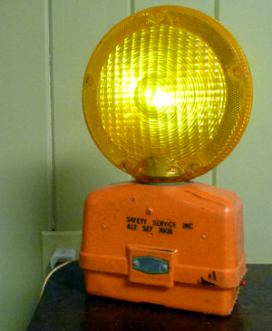

# Flasher

Found an old barrier flasher while cleaning out a garage 
and put in new electronics.  The device now has a couple 
operating modes so it can be used for different purposes.

Modes include:
* Flash every second
* Steady on
* Flash with random intervalues between 1/20th and 2 seconds
* Steady off

I added a button which can be pressed to move from mode to mode.  
You can see the button on the lower right side of the unit.

The project uses an Arduino Nano with the ATmega328 chip.

I power the Arduino with the USB connection so one 
can easily reprogram the device to add new modes or for special uses.

