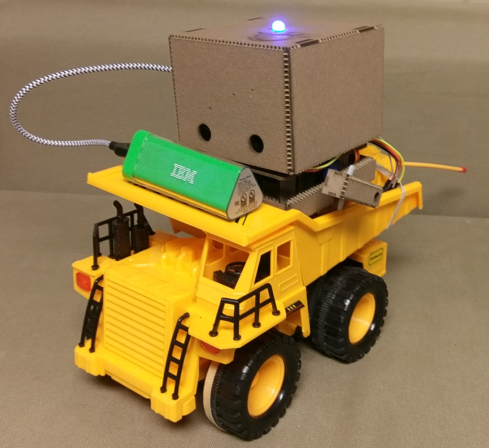
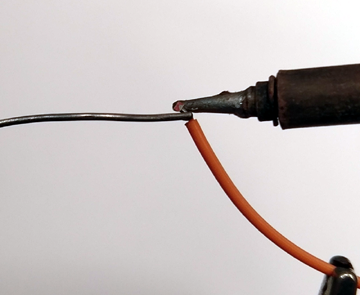
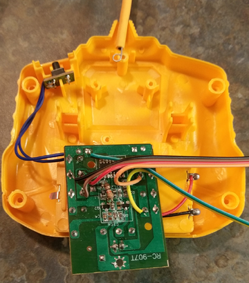
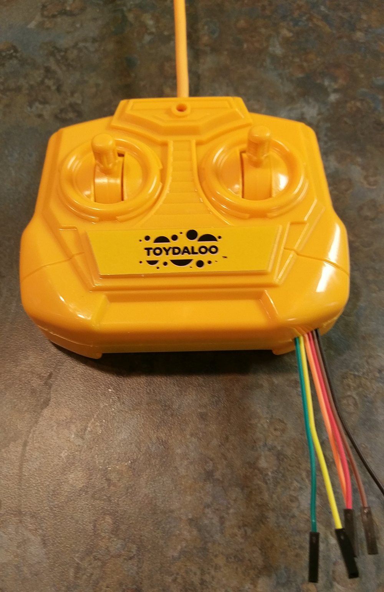
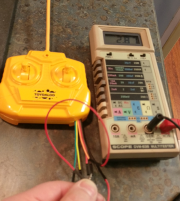

# TJBot Drives!

Sure, [TJBot](https://github.com/ibmtjbot/tjbot)
can't walk but there are other ways to be mobile.

This project will give TJBot the ability to control an RC truck to
provide mobility.  It uses an inexpensive RC vehicle as some hardware
modifications are required and one might not want to open the covers on
an expense device.

A soldering iron and some basic electronic experience will help with this 
project but with care this can be done as a first experience with both.

For this project a wireless headset is recommended rather than the
simple USB microphone as noise from the vehicle can interfere with the 
voice commends.  In the video below a wireless headset was used. 

You can also use a wired headset if you don't mind having to stay close to 
the vehicle.

#### Materials Needed:  

1. TJBot
2. A suitable RC vehicle (ones that use two 1.5 volt batteries are preferred)
3. Soldering iron and solder
4. Several proto-board jumpers (one end will be cut off)
5. Wireless headset (suggested, rather than simple USB microphone)

Once you have the RC vehicle you can look inside the controller to gain
a better understanding of what 
else is needed to connect it to the Raspberry Pi in the TJBot.

## Construction

#### Install the software in the Raspberry Pi (5 minutes)

The software and scripts assume the software is installed in `/opt`, a
standard directory for "optional" software.  To install the software use

    sudo sh -c 'cd /opt ; git clone https://github.com/pgcrumley/Projects.git'

This will place a copy of the software in `/opt` and leave behind
information that makes it easy to retrieve updates later if needed.

Next 

    cd /opt/Projects/TJBot_Drives/
    
and make sure there are
a number of python and other scripts present.

### Configure the software (15 minutes -- longer if system is not up-to-date)

Install python3 and the RPi.GPIO library using a command of:

    sudo apt-get -y install python3 python3-dev git python3-rpi.gpio

Make sure `python3` works and RPi.GPIO is installed by typing:

    python3
    import RPi.GPIO
    exit()

Your console should look like this:

    $ python3
    Python 3.4.2 (default, Oct 19 2014, 13:31:11)
    [GCC 4.9.1] on linux
    Type "help", "copyright", "credits" or "license" for more information.
    >>> import RPi.GPIO
    >>> exit()
    $

The version numbers may vary but there should not be any messages after the
`import RPi.GPIO` line.    

#### Connect pigtails to the RC controller buttons (30 minutes)

This step will require soldering ability and you will void any warranty
on the RC device.  If you need help with soldering I would refer you to some 
[soldering advice](http://www.instructables.com/id/How-to-Solder-Basic-Soldering-Guide/)
for more information.

Many of the simple controllers will use buttons or switches in the controller
which connect a signal to ground in order to activate a particular function.
The controller for the vehicle used here has 4 switches for the functions of:

1. Right-side Forward
2. Left-side Forward
3. Right-side Backward
4. Left-side Backward

With a bit of inspection you should be able to find where to attach to the 
transmitter board if you use a different vehicle.

Pigtails are connected to each of these signals so they can be pulled low by
the Raspberry Pi.  We will also connect a pigtail to ground and power so the 
transmitter is powered by the Raspberry Pi rather than by batteries.

The first thing to do is prepare the pigtails so it is easy to attach 
them to the board in the RC transmitter.  Cut off one end and expose a short
amount of the wire inside (about 2 mm).  Apply solder to the end of the wire
so it is ready to attach with just heat.

For this project the pigtails look like this:  (there will also be a pigtail
attached to the positive battery terminal)

Cut a slot for the pigtails to come out of the case.  The result should look 
something like this:

Once the pigtails are outside of the case it would be good to put batteries 
in the controller to make voltage and current measurements of the pins to 
ensure the voltage will not be larger than 3.3 volts and the current when the
signal is connected to ground is lower than the capabilities of the
Raspberry Pi.

Here we see the voltage is under 3.3 volts (as we expected since this is 
powered by two 1.5 volt batteries) and the current is about 2.8 mA which is
no problem for the Raspberry Pi.

Remove the batteries so you do not have the batteries competing with the 
Raspberry Pi voltage supplies.

#### Attach the pigtails and test the transmitter operation. (45 minutes)

Depending on the length of pigtail you used, it might be easier to extend
the pigtails with some Male - Female proto-board jumper wires.

Start by connecting just the 3.3 volt power and ground pigtails to the 
Raspberry Pi.  I would recommend using Raspberry Pi pins 17 and 25.  Please
note these are board numbers, not GPIO numbers.

With the RC transmitter powered from the Raspberry Pi make sure the normal
controls still properly operate the vehicle.  Once you are sure the 
transmitter still works correctly is it time to attach the pigtails for the 
other signals.

The signal to pin connections are:

| Signal | Board Pin |
| ------ | ------ |
| Right-Forward | 24 |
| Right-Backward | 26 |
| Left-Forward | 29 |
| Left-Backward | 31 |

#### Use the controller command to turn devices on and off. (2 minutes)

Run the driver_controller program to make sure the pigtails are connected 
properly.  Make sure the vehicle has plenty of space to drive and run

    sudo driver_controller.py
    
By default this command will drive:

1. forward for 1 second
2. left for 1 second
3. clockwise for 2 seconds
4. counter-clockwise for 2 seconds
5. backward for 1 second
6. right for 1 second 

You can use this program to control the vehicle.  

    sudo driver_controller.py --help
    
gives more details.

Once you have this working you are ready to have TJBot drive.

#### Configure REST server which allows control via REST. (5 minutes)

The TJBot program uses a REST server to control the vehicle.  TO have 
that server configured to start automatically each time the system is 
started.

As root:

    cd /opt/Projects/TJBot_Drives
    
To do this a configuration file is copied to the `/lib/systemd/system`
directory then the service is enabled to start automatically.  You can 
also start the service immediately without rebooting the system.

To set up the facility use

    cp tjbot_rest_server.service /lib/systemd/system
    systemctl enable driver_rest_server

You can start the service without rebooting by typing 

    systemctl start driver_rest_server

Finally, you can check the status of the service with 

    systemctl status driver_rest_server
    
This last command should provide out similar to 

    o  driver_rest_server.service - Run REST server for TOYDALOO RC dump truck controller
        Loaded: loaded (/lib/systemd/system/driver_rest_server.service; enabled; vendor preset: enabled)
        Active: active (running) since Mon 2018-01-01 22:31:22 EST; 4min 57s ago
      Main PID: 1245 (python3)
        CGroup: /system.slice/driver_rest_server.service
                \-1245 python3 /opt/Projects/TJBot_Drives/driver_rest_server.py

    Jan 01 22:31:22 tjbot systemd[1]: Started Run REST server for TOYDALOO RC dump truck controller.

You can now make the vehicle spin clock-wise with this command:

    curl -H 'Content-Type: application/json' -X POST -d '{"drive_ops" : [ ["cw", 1] ]}'  http://localhost:9999/

Notice the above command does not need the `sudo` command.  You do not need
root access to send the REST commands to the server.  This allows many
programs to share the devices.

By default the REST server only responds to requests which are sent from 
the same host but you can change the way the server is started by altering the 
`StartExec` line in the `.service` file so any host on your network
can send a REST command.  To do this add `--network_address 0.0.0.0`
to the end of the command and restart.

#### Prepare the node.js environment

Create a config.js file which holds your IBM Bluemix credintials for
the speech-to-text function.  This can be the same file as you used with 
the speech-to-text project in the normal TJBot recipe.

In addition to the credential information you need to add two additional
pieces of information to the config.js file which give the IP address 
of the REST server which sends appropriate signals to the RC transmitter.

    // Create the credentials object for export
    exports.credentials = {};

    // Watson Speech to Text
    // https://www.ibm.com/watson/developercloud/speech-to-text.html
    exports.credentials.speech_to_text = {
        username: 'xxxxxxxxxxxxxxxxxx',
        password: 'xxxxxxxx'
    }
    
    exports.drive_server_address = "127.0.0.1"; // by default use "localhost"
    exports.drive_server_port = 9999;  // by default use IP port 9999
    

Run 

    sudo npm install
    
to prepare the node.js environment.  This will take
some time.

#### Run the program

Now it is time to put your TJBot to work controlling devices.  Start the
program with

    sudo node drive.js

After a few seconds TJBot will be ready for a command.  
The program is listening for drive commands of "forward", "backward", "stop",
"right", "left", "clock-wise", "counter-clock-wise". 

#### Enjoy! 

#### If you have trouble

If you have trouble with this project, first make sure the RC controller is
able to control the vehicle.  After that make sure the REST server is running.

